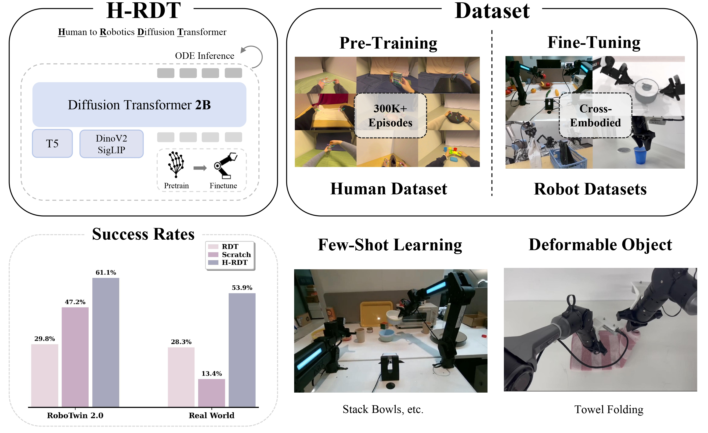

# H-RDT: Human Manipulation Enhanced Bimanual Robotic Manipulation
### 📝[Paper](https://arxiv.org/abs/2507.23523) | 🌍[Project Page](https://embodiedfoundation.github.io/hrdt) | 🤗[Model](https://huggingface.co/embodiedfoundation/H-RDT) | 💬[WeChat Contact](#-contact-us) 



## 📰 News
• **[2025.8.12]** Updated RoboTwin2 inference code

H-RDT (**H**uman to **R**obotics **D**iffusion **T**ransformer) is a novel approach that leverages **large-scale egocentric human manipulation data** to enhance robot manipulation capabilities. Our key insight is that large-scale egocentric human manipulation videos with paired 3D hand pose annotations provide rich behavioral priors that capture natural manipulation strategies and can benefit robotic policy learning.

## 🚀 Installation

1. **Create conda environment:**
   ```bash
   conda create -n hrdt python=3.10
   conda activate hrdt
   ```

2. **Install dependencies:**
   ```bash
   pip install -r requirements.txt
   ```

3. **Download pre-trained models:**
   ```bash
   export HF_ENDPOINT=https://hf-mirror.com
   huggingface-cli download --resume-download embodiedfoundation/H-RDT --local-dir ./
   ```

## 🔧 Usage

### Stage 1: Human Data Pre-training (EgoDx)

#### Data Preprocessing
Before training, preprocess the EgoDx dataset:

1. **Configure paths:**
   ```bash
   # Edit datasets/pretrain/setup_pretrain.sh with your paths
   nano datasets/pretrain/setup_pretrain.sh
   
   # Set your EgoDx dataset and T5 model paths:
   export EGODEX_DATA_ROOT="/path/to/your/egodx/dataset"
   export T5_MODEL_PATH="/path/to/your/t5-v1_1-xxl"
   ```

2. **Setup environment:**
   ```bash
   source datasets/pretrain/setup_pretrain.sh
   ```

3. **Run data processing pipeline:**
   ```bash
   # Automatically runs: precompute_48d_actions.py → calc_stat.py → encode_lang_batch.py
   ./datasets/pretrain/run_pretrain_pipeline.sh
   ```

#### Start Pre-training
After data preprocessing is complete:

**1. EgoDx Pretrain (fresh start):**
1. Configure dataset:
   ```python
   # Edit datasets/dataset.py line ~45
   self.dataset_name = "egodx"
   ```
2. Run training:
   ```bash
   bash pretrain.sh
   ```

**2. Pretrain Resume:**
Edit `pretrain.sh`, add this line:
```bash
--resume_from_checkpoint="checkpoint-450000" \
```

### Stage 2: Cross-Embodiment Fine-tuning

#### Data Preprocessing (for RobotWin2)
**Pre-computed language embeddings are already provided - no preprocessing needed!**

1. **Setup environment:**
   ```bash
   # Edit datasets/robotwin2/setup_robotwin2.sh if needed (only for regenerating files)
   source datasets/robotwin2/setup_robotwin2.sh
   ```

2. **Data processing pipeline (Not Required):**
   ```bash
   # Not needed - lang_embeddings/ already provided in repository
   # Only run if you want to regenerate files:
   # ./datasets/robotwin2/run_robotwin2_pipeline.sh
   ```

#### Robot Fine-tuning (load human pre-trained backbone):
1. Configure dataset:
   ```python
   # Edit datasets/dataset.py line ~45
   self.dataset_name = "robotwin_agilex"  # or your robot name
   
   # Add your dataset initialization if not exists:
   elif self.dataset_name == "your_robot":
       self.hdf5_dataset = YourRobotDataset(config=config)
   ```
2. Run training:
   ```bash
   bash finetune.sh  # Already configured with pretrained_backbone_path
   ```

#### Finetune Resume:
Edit your current finetune script, make these changes:
```bash
# Change this line:
--mode="finetune" \
# To:
--mode="pretrain" \

# And add:
--resume_from_checkpoint="checkpoint-5000" \
```

## 🎯 Training Modes

| Training Scenario | Base Script | Required Shell Script Modifications | Mode & Key Parameters |
|-------------------|-------------|-------------------------------------|----------------------|
| **Human Pretrain (Fresh)** | `pretrain.sh` | `--mode="pretrain"` | Start pretraining on EgoDx human data |
| **Human Pretrain Resume** | `pretrain.sh` | Add: `--resume_from_checkpoint="checkpoint-450000" \` | `--mode="pretrain"` |
| **Robot Fine-tuning** | `finetune.sh` | Change: `--mode="finetune" \`<br>Add: `--pretrained_backbone_path="./checkpoints/pretrain-0618/checkpoint-500000/pytorch_model.bin" \`<br>Change: `--config_path="configs/hrdt_finetune.yaml" \` | Load human pre-trained backbone, fresh action layers |
| **Robot Finetune Resume** | Your finetune script | Change: `--mode="finetune"` → `--mode="pretrain"`<br>Add: `--resume_from_checkpoint="checkpoint-5000" \` | Continue robot fine-tuning |

### Dataset Configuration

Before training, you need to configure the dataset in `datasets/dataset.py`:

#### For Human Pre-training (EgoDx):
```python
# In datasets/dataset.py, line ~45
self.dataset_name = "egodx"

# The EgoDxDataset will be automatically initialized
```

#### For Robot Fine-tuning:
```python
# In datasets/dataset.py, line ~45  
self.dataset_name = "your_robot_name"  # e.g., "robotwin_agilex"

# Add your dataset to the initialization logic:
elif self.dataset_name == "your_robot_name":
    self.hdf5_dataset = YourRobotDataset(
        config=config,
        # your dataset parameters
    )
```

#### Adding New Robot Datasets:
1. Create your dataset folder: `datasets/your_robot/`
2. Implement your dataset class (see `datasets/robotwin2/` as example)
3. Create data processing scripts (see `datasets/pretrain/` or `datasets/robotwin2/` as examples)
4. Import in `datasets/dataset.py`
5. Add initialization logic in `VLAConsumerDataset.__init__`

### Key Configuration Files
- `configs/hrdt_pretrain.yaml`: Human pre-training configuration
- `configs/hrdt_finetune.yaml`: Robot fine-tuning configuration  
- `datasets/dataset.py`: Dataset selection and initialization
- Modify `state_dim`, `action_dim`, `output_size` for your robot

## 📞 Contact Us

### WeChat Discussion Group
Join our WeChat group to discuss H-RDT related technical issues:

<div align="center">

<p><em>WeChat Group QR Code</em></p>
</div>

### Personal WeChat
For other questions or collaboration opportunities, please add personal WeChat:

<div align="center">

<p><em>Personal WeChat QR Code</em></p>
</div>

---

*Note: If the QR code expires, please contact us through project Issues for the latest contact information.*
